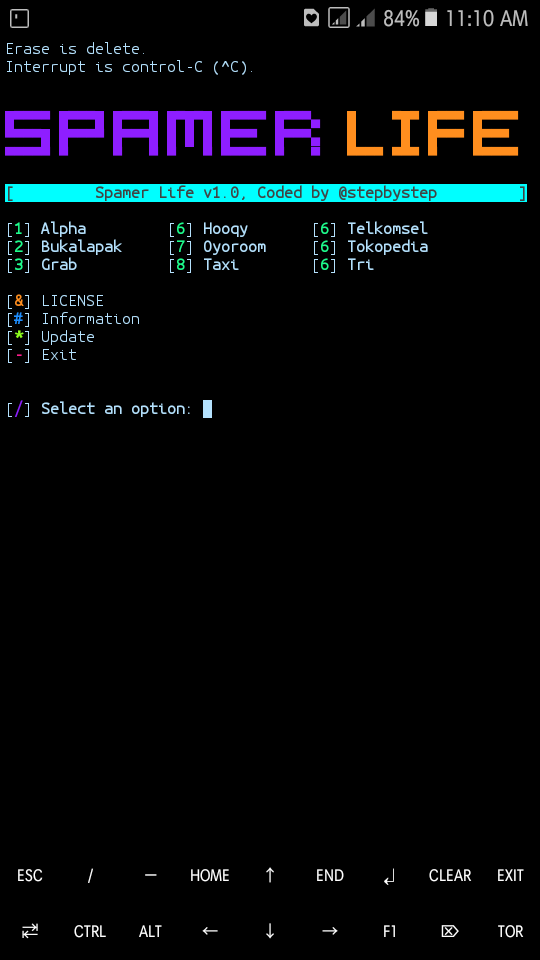

#### Screenshot:

#### Usage:
```
pkg update && pkg upgrade
apt-get install git
apt-get install bash
apt-get install python2
apt-get install php
git clone https://github.com/stepbystepexe/Spamerlife
cd Spamerlife
ls
bash spamerlife.sh
```
#### Paypal:
https://www.paypal.com/cgi-bin/webscr?cmd=_s-xclick&hosted_button_id=CLKRT5QXXFJY4&source=url
#### LiberaPay:
<noscript><a href="https://liberapay.com/stepbystepexe/donate"></a></noscript>
