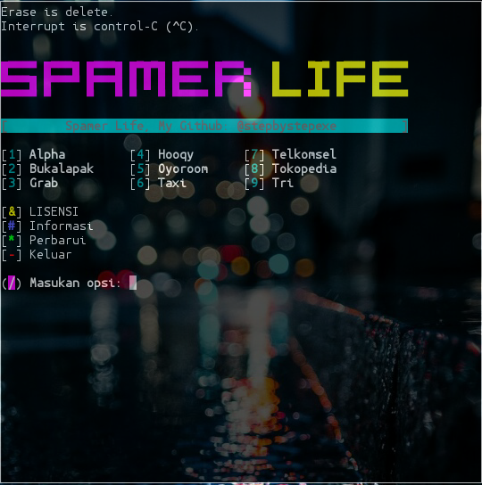

# Spamerlife:
*Spam adalah kegiatan mengirimkan pesan kepada orang lain dengan menggunakan perangkat elektronik secara terus-menerus dan dengan jumlah yang masif tanpa kehendaki oleh penerimanya, aktivitas spam ini disebut dengan spamming dan pelakunya disebut dengan spammer.*
#### Screenshot:

#### Cara Menginstall:
```
pkg update && pkg upgrade
apt-get install git
apt-get install bash
apt-get install python2
apt-get install php
git clone https://github.com/stepbystepexe/Spamerlife
cd Spamerlife
ls
bash spamerlife.sh
```
#### Kontak:
+ Email d_q16x@outlook.co.id
+ WhatsApp https://tinyurl.com/wel4alo
#### Paypal:
+ Onclick https://bit.ly/3dcEQcN
#### LiberaPay:
<noscript><a href="https://liberapay.com/stepbystepexe/donate"></a></noscript>
